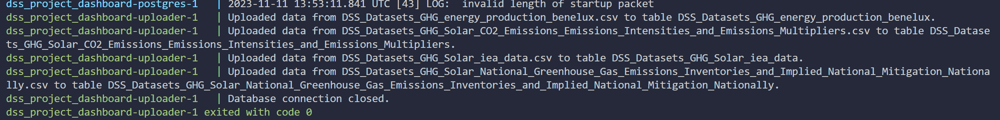

# Data Science and Society Dashboard: Greenhouse Gas Emissions for the Benelux Region and Solar as our Savior

## Overview

This repository hosts the Data Science and Society Dashboard, focusing on greenhouse gas emissions in the Benelux region and exploring the role of solar energy in reducing these emissions.

## Setup

The dashboard is containerized using Docker. Follow these steps to set it up:

### Prerequisites

- Docker installed and running on your machine.

### Installation

1. Clone this repository.
2. Follow the platform-specific instructions below.

### For Windows Users

- Run the `startup.ps1` PowerShell script.
- This script performs several tasks:
  - Executes Python/Selenium scripts to download current CSV data from IEA/IMF via Chrome.
  - Takes about 4 minutes to complete.
  - Once done, it runs the `docker-compose` command to set up the environment.
- Wait for the PostgreSQL database to initialize, and the uploader script to insert data. Look for specific confirmation lines in the terminal (shown below).
- 

### For Linux Users

- Run `chmod +x startup.sh`
- Execute the `startup.sh` Shell script using `./startup.sh` command
- Similar to Windows, this script downloads CSV data and sets up the Docker environment.
- Wait for the database and data uploader to complete their tasks.
- 

### For macOS Users

- Open the Terminal.
- Navigate to the cloned repository directory.
- Run `chmod +x startup_mac.sh` to make the script executable.
- Execute the `startup_mac.sh` Shell script using `./startup_mac.sh` command.
- This script will:
  - Install Homebrew (if not already installed).
  - Install Python 3.10 and pip using Homebrew.
  - Install required Python packages like pandas and selenium.
  - Download and set up ChromeDriver for running Selenium scripts.
  - Run Python scripts to download necessary data.
  - Start the Docker environment using `docker-compose`.
- Wait for the PostgreSQL database to initialize, and the uploader script to insert data. Look for specific confirmation lines in the terminal (shown below).
- 

## Using the Dashboard

- Access the Dashboard at: http://localhost:8501/
- The Dashboard caches queries for improved performance. Switching between panels should not always trigger a re-run of queries. Sometimes you might need to refresh if your screen isn't showing the page icon's.
