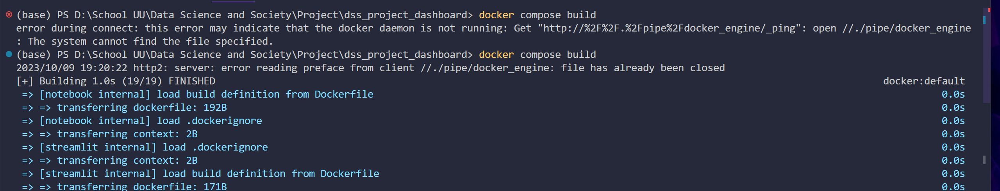

# Data Science and Society Dashboard: Greenhouse Gas Emissions for the Benelux Region and Solar as our Savior

This repository contains a Docker Compose file for running a Data Science and Society Dashboard that displays greenhouse gas emissions for the Benelux region and the potential of solar energy to reduce those emissions.

To set up the Docker environment, you will need to have Docker Desktop installed and running. Once you have Docker Desktop running, you can clone this repository and run the following two commands (while being in the director you just cloned down as shown in the screenshot below):

`docker compose build`

`docker compose up`

The build command will build the Docker images for all of the services defined in the Docker Compose file. The up command will start all of the services and expose them on the appropriate ports.

Once the services are running, you can access the dashboard at [http://localhost:8501](http://localhost:8501).

Troubleshooting:

If you are having trouble running the dashboard, please check the following:

Make sure that Docker Desktop is installed and running.
Make sure that you have cloned this repository to your local machine.
Make sure that you have run the docker compose build and docker compose up commands.
If you are still having trouble, please open an issue in this repository.
